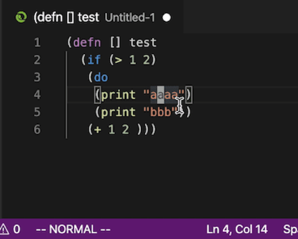
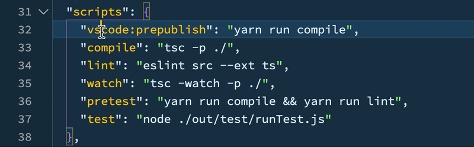

# Block Select
This is a simple plugin that support to quick select text between matched blocks.
This plugin support `()`, `{}` and `[]`,`""`, `''`, and can not be customized.
Really hope this plugin can help you!

## Quick start
Just run command `BraSel:Select` or type `alt+a` to select text between blocks. If you wish to select more, just press it again.

If you slected more than you want, at anytime, just press `alt+z`(undo selection), you will bring the previous selections back.

  
If you wish to select text including the blocks, just run `BraSel:Select Include Blocks` or type `cmd+alt+a` on mac and `ctrl+alt+a` on windows.

This plugin is works for **multiple cursors**  now.

## Requirements
None

## Extension Settings

